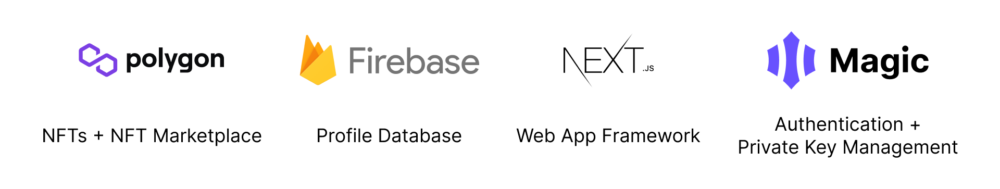

# GNFT
Create, mint and collect generative art NFTs.

https://user-images.githubusercontent.com/59069682/162537673-e6c43ed3-b8cd-4c77-a0e0-5eba751a0634.mp4

## Powered by 

## Smart Contarcts

The web app is powered by 2 smart contracts: [`GNFT.sol`](./contracts/GNFT.sol) and [`GNFTMarket.sol`](./contracts/GNFTMarket.sol). The contracts are deployed to the Mumbai Testnet at the following addresses:

- GNFT: [0xE64E2Bc6693c5dC2c1b88302973346497A731cE0](https://mumbai.polygonscan.com/address/0xE64E2Bc6693c5dC2c1b88302973346497A731cE0)
- GNFTMarket: [0x8E4c5943A78766c436dc7A7d97f1f80f660Ac280](https://mumbai.polygonscan.com/address/0x8E4c5943A78766c436dc7A7d97f1f80f660Ac280)

## Web App
The web app is deployed at [g-nft.app](https://g-nft.app)
### Landing Page

The landing page introduces the web app and displays a few items that are currently listed in the marketplace. 

### Create Page

The create page provides a block style p5.js editor. As blocks are edited, variable declarations create sliders for quickly updating numeric values. Once satisfied with the sketch, it can be minted as an NFT.

### Market Page

The market page displays tokens that are currently listed on the GNFTMarket contract and allows authenticated users to make purchases. The cards also link to creator and seller profiles, along with the token's details page.

### Token Page

The token page displays the metadata defining the NFT and allows for listing or purchasing the token depending on it's owner and the authenticated user's address.

### Wallet Page

The wallet page displays collected and created tokens and allows users to transfer tokens to other users. Users may also select a token they own as their profile image, and share the link to the public profile page. 

### Profile Page

The profile page allows others to see a user's created and collected tokens.

## Process Documentation Blog

The process documentation blog for this project can be found in the [wiki pages](https://github.com/patrickjamesmardis/gnft/wiki).

| Entry Title                                                                                                  | Date   |
| ------------------------------------------------------------------------------------------------------------ | ------ |
| [Iteration 3: Explore Phase](https://github.com/patrickjamesmardis/gnft/wiki/Iteration-3:-Explore-Phase)     | Apr 5  |
| [Iteration 3: Speculate Phase](https://github.com/patrickjamesmardis/gnft/wiki/Iteration-3:-Speculate-Phase) | Mar 15 |
| [Iteration 2: Adapt Phase](https://github.com/patrickjamesmardis/gnft/wiki/Iteration-2:-Adapt-Phase)         | Mar 11 |
| [Iteration 2: Explore Phase](https://github.com/patrickjamesmardis/gnft/wiki/Iteration-2:-Explore-Phase)     | Mar 1  |
| [Iteration 2: Speculate Phase](https://github.com/patrickjamesmardis/gnft/wiki/Iteration-2:-Speculate-Phase) | Feb 15 |
| [Iteration 1: Adapt Phase](https://github.com/patrickjamesmardis/gnft/wiki/Iteration-1:-Adapt-Phase)         | Feb 11 |
| [Iteration 1: Explore Phase](https://github.com/patrickjamesmardis/gnft/wiki/Iteration-1:-Explore-Phase)     | Feb 1  |
| [Iteration 1: Speculate Phase](https://github.com/patrickjamesmardis/gnft/wiki/Iteration-1:-Speculate-Phase) | Jan 18 |
| [Iteration 1: Envision Phase](https://github.com/patrickjamesmardis/gnft/wiki/Iteration-1:-Envision-Phase)   | Jan 11 |
